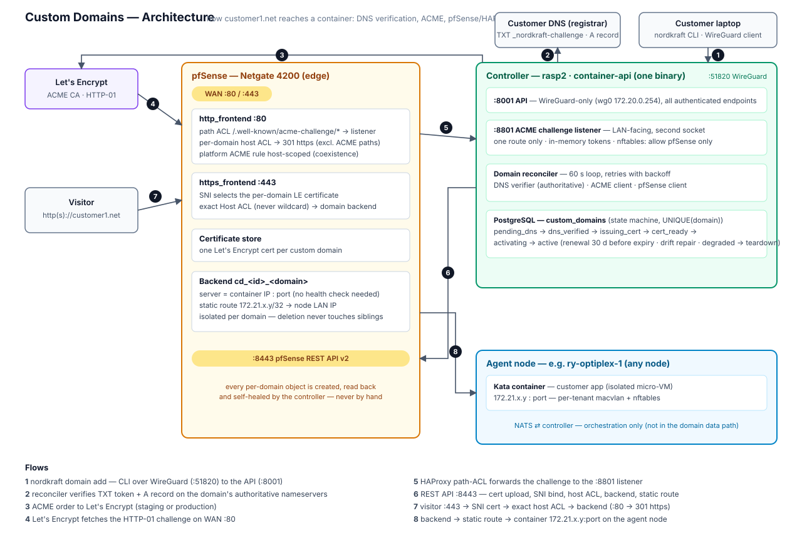

# Custom Domains (bring your own domain)

Lets a customer point their own domain (e.g. `customer1.net`) at a container
running on NordKraft Garage Cloud, with automatic TLS. Builds on the pfSense +
HAProxy ingress from [INGRESS_PFSENSE.md](INGRESS_PFSENSE.md) — set that up
first.

> **Design goal: slow and 100 %, never fast and 95 %.** Everything
> failure-prone (DNS propagation, ACME, pfSense API) runs in a background
> reconciler with retries and read-back verification. `nordkraft domain add`
> returns instantly with DNS instructions; activation typically completes
> 5–30 minutes after the customer's DNS records propagate.

---

## How it works



```
nordkraft domain add customer1.net --container myapp
        │  (returns TXT + A record instructions immediately)
        ▼
 pending_dns ──► dns_verified ──► issuing_cert ──► cert_ready ──► activating ──► active
      ▲                                                                            │
      │   2 consecutive checks against the                        read-back        │
      │   domain's AUTHORITATIVE nameservers                      verified         │
      │                                                                            ▼
      └── customer publishes:                                        daily re-check:
          _nordkraft-challenge.customer1.net TXT "nk-verify=<token>"  - DNS still points here?
          customer1.net                      A   <INGRESS_PUBLIC_IP>  - cert renewal (30 d before expiry)
                                                                      - pfSense object drift repair
                                                                      - container IP drift repair
```

Traffic path once active:

```
Internet → pfSense :443 → https_frontend (SNI picks the customer1.net cert)
        → exact-match Host ACL → dedicated backend → 172.21.x.y:port

Internet → pfSense :80  → http_frontend → 301 https://customer1.net/…
        (per-domain redirect; ACME challenge paths are excluded via the
         nk_acme_path ACL so HTTP-01 renewals keep working on port 80)
```

**Isolation guarantees** (same philosophy as platform ingress, enforced by
construction):

- Host ACLs are **exact match only** — never wildcards. No overlap between
  tenants is possible.
- **No routing object exists before verification**: the ACL/backend are only
  created after the TXT token verifies against authoritative DNS *and* Let's
  Encrypt has independently validated the domain via HTTP-01.
- `UNIQUE(domain)` in the database — one owner per hostname, ever.
- pfSense object names derive from the DB row id (`cd_<id>_<sanitized>`),
  never from raw user input.
- Domains equal to or under `INGRESS_BASE_DOMAIN` are rejected, as are IP
  literals, bare public suffixes (`co.uk`), wildcards, and non-normalized
  unicode (IDNA/punycode is applied first).
- If DNS stops pointing at the platform, the domain goes `degraded`; after
  `CUSTOM_DOMAINS_GRACE_DAYS` (default 7) routing and certificate are torn
  down automatically, so a future owner of the domain can never receive the
  old tenant's traffic.

**TLS:** the controller runs its own ACME client (`instant-acme`, HTTP-01)
and pushes issued certificates into the pfSense certificate store, bound to
the HTTPS frontend via SNI. One state machine, in one database — the pfSense
ACME package is NOT used for custom domains. Private keys are generated per
order and exist only in transit to pfSense; the database stores only the cert
refid + expiry.

---

## Prerequisites

1. Working platform ingress per [INGRESS_PFSENSE.md](INGRESS_PFSENSE.md)
   (frontends, wildcard cert, REST API v2).
2. Port 80 open — Let's Encrypt HTTP-01 validation arrives there.
3. A controller firewall rule allowing pfSense to reach the challenge
   listener (see Setup step 4).
4. If the pfSense **ACME package** also issues certificates via HTTP-01 on
   this box, its HAProxy rule must be host-scoped first — see
   "Coexistence with the pfSense ACME package" below, or every
   custom-domain challenge will be swallowed by the package's responder
   (symptom: permanent 503 on `/.well-known/acme-challenge/*`).

## Coexistence with the pfSense ACME package

The ACME package's HTTP-01 setup typically adds a path ACL (often named
`is_acme`, matching `/.well-known/acme-challenge/`) with a `use_backend`
action to its own validation backend, **evaluated before** any action
container-api appends. Unscoped, it captures challenge traffic for *every*
hostname — including customer domains — and returns 503 whenever the
package's responder isn't mid-issuance.

Fix (one-time, in Services → HAProxy → Frontend, wherever that action
exists — usually only the HTTP frontend):

1. Add one ACL row per platform hostname the package issues certificates
   for, all with the **same name** so they OR together:
   `is_platform_host` / *Host matches* / `cloud.example.dk` (repeat per host)
2. Edit the package's `use_backend <acme validation>` action: change its
   condition from `is_acme` to `is_acme is_platform_host` (space = AND).
3. Apply.

Result: platform-host challenges → the package's responder; every other
hostname falls through to container-api's challenge route (which the
startup bootstrap appends after existing actions, keeping this priority).
Package renewals and custom-domain issuance then coexist safely.

## API surface verification (done — optional re-check)

The two REST API v2 surfaces the custom-domain code depends on have been
**confirmed against the official OpenAPI spec (pfrest.org) and the package
source**:

- `POST /api/v2/system/certificate` — fields `descr`, `type` (`server`),
  `crt`, `prv`; `crt`/`prv` take **raw PEM** (the API base64-encodes for
  config.xml itself — sending base64 fails `X509_VALIDATOR_INVALID_VALUE`;
  verified on hardware). A full chain in `crt` is accepted. Response
  carries `data.refid`.
- `POST/DELETE /api/v2/services/haproxy/frontend/certificate` — child object
  with `parent_id` + `ssl_certificate` (cert refid); the frontend's
  additional-certs array is `ha_certificates`.

If you ever upgrade the REST API package and want to re-verify by hand
(replace key/host):

```bash
# 1. Certificate upload — expect 200 and a "refid" in data
curl -sk -H "X-API-Key: $KEY" -H "Content-Type: application/json" \
  -X POST https://pfsense/api/v2/system/certificate \
  -d '{"descr":"nk-spike-test","crt":"'$(base64 -w0 test-cert.pem)'","prv":"'$(base64 -w0 test-key.pem)'"}'

# (generate a throwaway pair first:
#  openssl req -x509 -newkey rsa:2048 -keyout test-key.pem -out test-cert.pem -days 1 -nodes -subj "/CN=spike.test")

# 2. Frontend certificate child object — check the field name.
#    Look at your HTTPS frontend and find how "Additional certificates" appear:
curl -sk -H "X-API-Key: $KEY" \
  "https://pfsense/api/v2/services/haproxy/frontends" | python3 -m json.tool | less
# → find your https_frontend object; note the array holding extra certs
#   (expected: "ha_certificates" with entries carrying "ssl_certificate": "<refid>")

# 3. Try binding the spike cert:
curl -sk -H "X-API-Key: $KEY" -H "Content-Type: application/json" \
  -X POST https://pfsense/api/v2/services/haproxy/frontend/certificate \
  -d '{"parent_id": <https_frontend_id>, "ssl_certificate": "<refid-from-step-1>"}'

# 4. Clean up the spike cert afterwards (find id via /api/v2/system/certificates).
```

If step 2/3 show a different endpoint or field name, adjust the two constants
`FRONTEND_CERT_ENDPOINT` and `FRONTEND_CERT_FIELD` at the top of the
custom-domain section in `container-api/src/services/haproxy_client.rs` —
nothing else references them.

---

## Setup

### 1. Back up the database

Take a full dump of `garage_cloud` before touching the schema. The migration
is purely additive (one new table, one trigger — it does not modify existing
tables), but a backup makes every next step reversible:

```bash
# Custom-format dump (compressed, restorable table-by-table with pg_restore).
# NOTE: redirect (>) rather than -f: pg_dump runs as the postgres user, which
# cannot write into your home directory — the redirect is performed by YOUR
# shell, so the file is created with your ownership.
sudo -u postgres pg_dump -F c -d garage_cloud \
  > ~/garage_cloud_$(date +%Y%m%d_%H%M%S).dump
```

Verify the file exists and has a plausible size before continuing:

```bash
ls -lh ~/garage_cloud_*.dump | tail -1
```

To restore (worst case — this recreates the DB as it was at dump time):

```bash
# Same trick in reverse: postgres cannot read your home dir, so feed the
# dump via stdin (<) from your own shell.
sudo -u postgres pg_restore --clean --if-exists -d garage_cloud \
  < ~/garage_cloud_<timestamp>.dump
```

To undo *only* this migration, no restore is needed:

```bash
psql -U garage_user -d garage_cloud \
  -c "DROP TABLE IF EXISTS custom_domains CASCADE;"
```

### 2. Apply the database migration

```bash
psql -U garage_user -d garage_cloud -f setup/migration_custom_domains.sql
```

### 3. Configure container-api

```bash
# Enable the feature (requires INGRESS_ENABLED=true)
export CUSTOM_DOMAINS_ENABLED=true

# ACME / Let's Encrypt
export ACME_CONTACT_EMAIL=you@example.dk   # required
export ACME_STAGING=false                  # true = LE staging CA (testing; untrusted certs)

# Bind address of the DEDICATED ACME challenge listener — a second socket
# inside the same container-api process, serving exactly one route
# (GET /.well-known/acme-challenge/<token>). Bind it on the controller's
# LAN IP so pfSense/HAProxy reaches it directly; the main API keeps its
# WireGuard-only BIND_ADDRESS untouched.
# Default: CONTROLLER_INTERNAL_IP:8801
export CUSTOM_DOMAINS_CHALLENGE_ADDR=10.0.0.200:8801

# Optional tuning (defaults shown)
export CUSTOM_DOMAINS_MAX_PER_USER=5
export CUSTOM_DOMAINS_RECONCILE_INTERVAL=60      # seconds between reconciler passes
export CUSTOM_DOMAINS_GRACE_DAYS=7               # degraded → auto-teardown
export CUSTOM_DOMAINS_RENEW_BEFORE_DAYS=30       # cert renewal lead time
export CUSTOM_DOMAINS_RECHECK_SECONDS=86400      # steady-state health re-check
```

Restart `container-api`. On startup (controller/hybrid) it idempotently
creates the shared ACME challenge plumbing on HAProxy:

- backend `nk_acme_challenge` → `CUSTOM_DOMAINS_CHALLENGE_ADDR`
- path ACL `nk_acme_path` (`path_starts_with /.well-known/acme-challenge/`)
  + `use_backend` action on **both** frontends (both, because an HTTP→HTTPS
  redirect makes Let's Encrypt retry the challenge on 443).

Check logs:

```bash
journalctl -u nordkraft -n 50 | grep -E "(Custom domains|ACME|Domain reconciler)"
# Expect: "🌍 Custom domains enabled …", "✅ ACME challenge routing bootstrapped",
#         "🌍 Domain reconciler started …"
```

> **Security model:** the main API keeps its WireGuard-only bind — nothing
> about it changes, and no pfSense static route is needed. The challenge
> listener is a separate LAN-facing socket in the same process whose entire
> surface is one read-only route serving in-memory tokens that exist only
> while an order is in flight. There is nothing to enumerate and no
> authenticated endpoint reachable from the LAN.
>
> The startup bootstrap self-heals the pfSense objects: if
> `CUSTOM_DOMAINS_CHALLENGE_ADDR` changes, the existing HAProxy backend
> server is PATCHed to the new address on the next restart, and the
> backend's health check is kept disabled (the listener answers 404 to
> anything but a live token, which an HTTP health check would misread as
> "down").

### 4. Open the controller firewall for the challenge listener

The controller's nftables input chain is default-drop; pfSense must be
allowed to reach the challenge port. Add the rule live:

```bash
sudo nft insert rule inet filter input ip saddr <pfsense-lan-ip> tcp dport 8801 accept comment \"acme-challenge-from-pfsense\"
```

…and persist it by adding the same line to your base ruleset (typically
`/etc/nftables.conf`, next to the existing API-port rule). Validate the
file without applying it (`nft -f` would flush runtime tenant rules):

```bash
sudo nft -c -f /etc/nftables.conf
```

Verify from pfSense (Diagnostics → Command Prompt):

```bash
curl -s -o /dev/null -w "%{http_code}" http://<challenge-addr>/.well-known/acme-challenge/test
# expect 404
```

### 5. Customer flow

```bash
# Customer registers their domain
nordkraft domain add customer1.net --container myapp
# → prints the TXT + A records to add at their DNS provider

# Customer checks progress any time
nordkraft domain status customer1.net
nordkraft domain verify customer1.net    # force a re-check right now

# When status = active:
# https://customer1.net → myapp, valid Let's Encrypt certificate
```

Apex domains use an A record; subdomains (`www.customer1.net`) may instead
CNAME to any platform hostname. `www` and the apex are separate hostnames —
add each explicitly (exact-match only, by design).

---

## Operational notes

**Everything is retried with backoff.** DNS checks run every reconciler pass;
ACME failures back off 15 min → 6 h (Let's Encrypt allows 5 validation
failures per hostname per hour — the backoff keeps you far under). `last_error`
on the row (shown by `nordkraft domain status`) always says what's blocking.

**'active' is never optimistic.** A domain only reaches `active` after the
backend, ACL, action, and cert binding have been read back from pfSense.
The daily steady-state pass re-verifies all of it and repairs drift —
including pfSense reboots losing static routes and container redeploys
changing IPs.

**Renewals** happen 30 days before expiry: new cert issued and bound *before*
the old one is unbound (no TLS gap), then the old one is deleted.

**Rate limits:** Let's Encrypt production allows 50 certs/registered domain
/week — irrelevant at our volumes, but use `ACME_STAGING=true` when testing
repeatedly against the same domain.

**Removal** (`nordkraft domain remove`) tears down in reverse order:
action → ACL → backend → cert unbind → cert delete → static route (only if no
other route still uses the same container IP).

## Troubleshooting

### Stuck in pending_dns
`nordkraft domain verify <domain>` shows which of the two records is missing.
Remember the TXT check runs against the domain's **authoritative**
nameservers — a propagated-looking record in your local resolver cache is not
enough, and conversely you don't have to wait for full global propagation.

### issuing_cert fails repeatedly
Let's Encrypt could not fetch the challenge. Verify port 80 reaches HAProxy,
and the challenge routing exists (Services → HAProxy → Frontend: the
`nk_acme_path` ACL) and points at a reachable `CUSTOM_DOMAINS_CHALLENGE_ADDR`.
Test from outside:
`curl http://customer1.net/.well-known/acme-challenge/test` → expect 404 from
container-api (not a pfSense error page).

### Domain shows degraded
The domain stopped resolving to `INGRESS_PUBLIC_IP`. Restore the A/CNAME
record within the grace period and it re-activates automatically.
